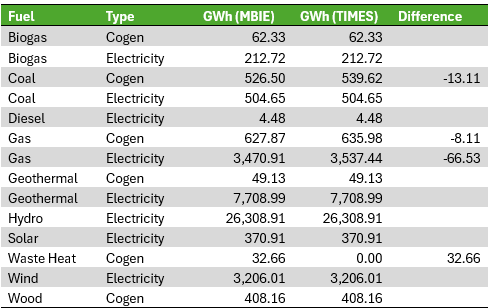
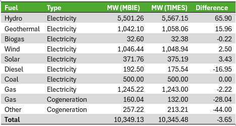

# Base year electricity supply 

```
Calibrating the TIMES NZ base year data for electricity generation 
```

This documentation describes the methods used in `scripts/stage_2_baseyear/baseyear_electricity_generation.py`.


The base year generation data is intended to reflect the distribution of 2023 generation across all generating New Zealand assets. 
These should be available to the model to meet future demand, but with enough information (region, technology, remaining life, etc) that the model will retire plants at appropriate points and can make least-cost dispatch and peak decisions. 

We have improved on TIMES 2.0 by building a bottom-up, asset-based model of the existing generation fleet. This gives us much greater detail in how the model utilises the existing generation fleet, will allow us to make very precise changes as needed. 

Note that this does mean updating the base year will currently require a manual review of this existing asset list.

# Raw data used 

- MBIE genstack (current plants)
- MBIE official electricity statistics
- Electricity Authority fleet list
- Electricity Authority MD generation data


# Detailed method

## 1 Existing Asset List

EECA has prepared a list of current plants for the base year generating stock. This is closely based on the EA dispatch generation fleet list (found here), and includes mapping to the current plants from MBIE’s EDGS Generation Stack (ADD LINK). Where possible, we have included mapping to plant names found in the Electricity Authority’s generation data by plant (ADD LINK).

The list has been reviewed and updated based on developer statements and Energy News factfiles for each plant. Several offgrid cogeneration plants are not included in either the EA or MBIE data, as well as some offgird. In some cases, capacities were updated or names were adjusted slightly. 

This list is not intended to capture all distributed or cogeneration facilities, which are instead represented by generic plants (see below). However, it should capture all plants that solely inject into the grid at the end of the base year 2023. 

In general, plant status has been set to align with MBIE categories for 2023. For example, Kaiwera Downs Stage 1 is considered for the base year, but the rest of the build is considered a future technology. (Kaiwera Downs was only partially operational by the end of 2023).

Note that updating the base year will require a manual review of the plant list for whatever future year we update for. It might be that we could r

## 2 Distributing base year generation using Electricity Authority data

We use the Electricity Authority’s Generation by Plant (ADD LINK)  (“Generation_MD”) data to find estimates of generation for the current plant lists. This bottom-up approach means we can assign known generation to regions and technologies. 

This data covers 93%* of total generation for 2023. For the remaining generation, we make some assumptions on the location and technology of distributed generation (cogeneration or otherwise) to calibrate final figures with the MBIE data. 

For plants where we include multiple stages, but there is only one reference in the EMI data (such as Ngawha or Turitea), generation is proportionally distributed by the stage’s capacity.

There are minor limitations in using this dataset. First, it covers only metered injections into the grid, leading to unusually low figures for cogeneration plants that also supply industrial sites behind the grid. It also does not cover generation behind the grid, such as rooftop solar panels or the embedded Lodestone solar farms in Northland. The Authority also notes some issues in the estimate techniques, and notes that:

```
“This data series will be replaced by one that is more reliable… at some point in the future”.
```

To alleviate these minor issues, we will calibrate our final base year generation figures against MBIE official statistics, which include all generation and cogeneration, not just that injecting into the grid. 


*40,597 GWh in the EA’s dataset is 93% of the 43,494 GWh reported by MBIE for 2023. 

## 3 Capacity factor estimates 

In some cases, using generation data from the Electricity Authority is either incomplete or results in implied capacity factors outside normal ranges. This is especially true for some cogeneration plants, but can also indicate that the asset mapping to Electricity Authority plant definitions was inaccurate.

In these cases, we instead set some plants to have generation estimated by capacity factor. Capacity factor assumptions for different technologies are provided to the model already, so we can use these assumptions to assume generation for given plants. 

## 4 Custom Treatment: Huntly Rankine Units

EMI data for the Huntly Rankine Units does not distinguish the proportions of coal or gas used for generation. We therefore assume the generation from coal is equivalent to MBIE figures on total coal electricity generation (i.e. excluding cogeneration), and the remaining share is from natural gas. This section is scripted separately. 

A note on biomass: In February 2023, Genesis completed a biomass trial at the Rankines. This means some small proportion of the generation was fuelled by imported wood pellets. We assume these figures are negligible overall, and they are currently not included in the base year model.

## 5 Adding distributed solar generation


EMI does not provide figures on rooftop solar generation. We therefore create generic plant stocks intended to represent different levels of rooftop solar generation (residential, commercial, and industrial), and distribute MBIE’s official solar generation statistics according to region and island based on EMI distributed solar capacity data. 
A stock model is applied to the existing stock of distributed solar generation to estimate the rate at which panels are retired from rooftops across the model horizon.

The implied capacity factor is a little over 11% when considering 2023 solar generation estimates from MBIE against solar capacity available at the end of 2023. This is quite low, but reflects that some of this capacity came online towards the end of the year, meaning there was only partial generation. 

Potential improvement: use the EA solar capacity data to estimate the age distribution of existing solar stock. This will give TIMES a more accurate stock model. 

## 6 Calibrating to official data and adding generic plants. 

After adding either Electricity Authority generation data or plant generation estimates based on capacity factors, we calibrate total figures against official MBIE generation data (broken down by cogeneration status and fuel type). We expect to still be missing some generation when comparing to official statistics, which reflects smaller embedded or other plants not available in our plant list or Electricity Authority solar capacity data. 

We therefore add a few parameters for potential “generic” existing plants, and these have their capacities and generation figures for the base year generated automatically based on the missing generation data and capacity factor assumptions. In cases where they may be on either island (such as wind or hydro), they are distributed according to the known regional distribution of similar plants. In other cases (such as geothermal or natural gas plants) they are distributed only across the North Island. 

## 7 Final results 

This allows us to produce a list of plants by region, with ages, capacities, cogeneration status, base year generation. This can be found at (ADD LINK). For distributed solar, we can distribute the capacity further by region and sector that it services (residential, commercial, or industrial). 

## 8 Checks against official statistics 

### Calibration to official generation 


Calibrating the base year figures against official generation stats gives the following results: 





This method results in mostly perfect calibration with MBIE generation data. Some estimates are slightly higher in the original Electricity Authority data, particularly for gas generation. We currently assign coal cogeneration to Glenbrook. We exclude MBIE’s waste heat in the base model, as we don’t have enough information about this to include it in TIMES. 

Overall, this means our base model will generate an extra 55GWh in 2023 compared to official data. This is a 0.13% difference – well within statistical difference in official reporting.

### Calibration to official capacity  



Capacity figures are slightly less well-aligned, but we are forced to assume capacity factors for some plant types, which might not align with specific plants actual capacity factors in 2023. Maintenance or unusual rainfall or a host of other factors could lead to different actual capacity outputs. This leads to minor miscalibrations, particularly for Hydro, but the overall levels are within 4 MW of MBIE values, or 0.035%.


# TO-DO: 


1.	Add concordance table for plant life by tech – this already exists so a matter of adding to the repo.  
2.	Add concordance for peak contribution rates per tech. As above.
3.	Add concordance for for TIMES use (In, Out, Cap). This will require a TIMES name generation method of some kind to avoid a lot of manual work.
4.	Format for TIMES: create existing plant table with VAROM, FIXOM, CAP, LIFE, Peak cont, CAP, ACT_BND_FX, perhaps ACT_BND_FX for 2024 as well since we have that data.
