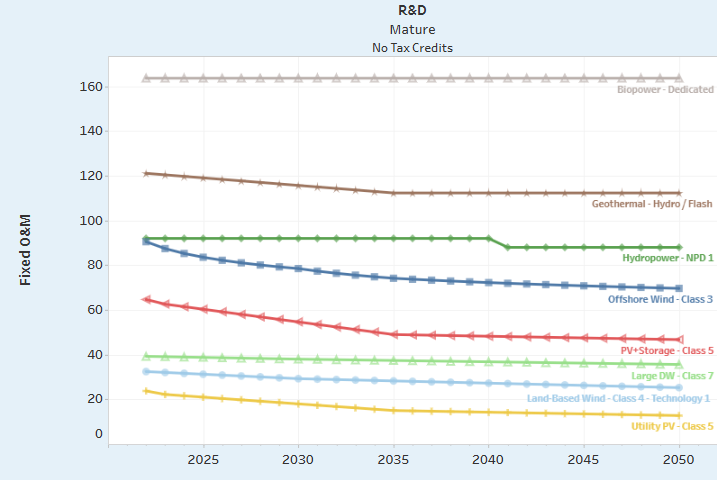
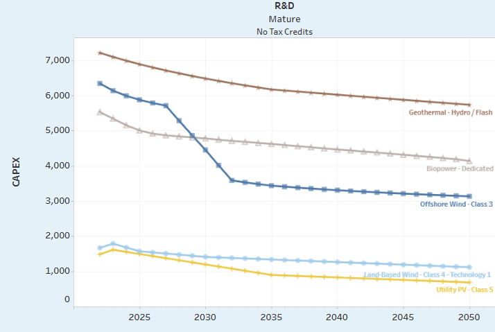

# Learning Curves and Other New Tech Data

For the learning curves of each of the different generators, projection data from NREL was used. The data was from 2024 and projected costs from 2022 up to 2050. As this data was for the US we wanted to use these projected curves on data that we could obtain from New Zealand. The data provides three scenarios: advanced, moderate, and conservative. In TIMES 2.0 the projections of the moderate curve were used in the Kea scenario and the conservative curve was used for the Tui scenario. 

Below show some of the curves from the NREL database which are seen [here][NREL-database]. (The parameter can be changed to CAPEX and FOM to get these graphs). 

The FOM graph below shows that the changes in cost over time are minimal.  The CAPEX costs show greater change over time, particularly for offshore wind.

We applied these curves to future technologies (solar, wind, and geothermal).  From the NREL ATB 2024 workbook we can easily take the data that was produced and use this to create learning curves for utility solar, wind, and geothermal.  As the NREL data has different classes for the tech with different curves for each there was some choice as to which curve would be used. 

The MBIE data did not specify whether the future solar farms would be tracking or fixed, but this could be easily looked up. To make this quick, farms with a higher capital cost per kW were investigated as the tracking solar is much more likely to be more expensive than fixed solar. The NREL data only had curves for tracking solar for the utility scale and so the curves for this were used in both the tracked and fixed cases. The Utility PV- Class 1 curve was used in these cases. The TechName of the tracking solar farms were changed to Tracked Solar to distinguish from the fixed solar farms.

For wind, all of the MBIE data was for onshore wind projects and so the NREL data for onshore wind was used. The tech chosen was Class 2 which takes wind speeds between 8.8 and 9 m/s. 

# Python Code Explanations
All of the functions used in these calculations and manipulations can be found in the dataprep.py file in the library.

We also wanted to choose which of the MBIE GenStack data that we wanted to apply the learning curves to. First, we wanted to choose which scenario from the Gen Stack data that we wanted to use, and so the Reference scenario was chosen as each of the scenarios were found through scaling the costs from this scenario. We also didn’t care about any of the current plants so these were also filtered out in the code.

Next, the solar, wind, and geothermal technologies, and the plants with a status of “fully consented” and “under construction” were filtered out as the capital and connection costs of these should be pretty much fixed. Alongside this, all the plants with commissioning years before 2030 were filtered out as fixed costs as it’s assumed that these shouldn’t change too much.  

That leaves the future wind, solar, and geothermal techs, that the learning curves were then applied to. 

The learning curves had to be taken from the NREL ATB database. For this, the data for projected CAPEX and FOMs were copied and pasted into a new csv file to be able to integrate with Python easier. These csv files could then be filtered to get the data that is required for the curves. The curves were calculated using the percentage indices of the costs from 2023 onwards as the MBIE data has a base year of 2023. 

The corresponding learning curves could then be applied to the capital cost and FOMs for each tech in the filtered MBIE list. For the CAPEX we also wanted to account for the connection costs and so the connection cost per kW of capacity was calculated and added to the costs found by applying the learning curves as a constant. The CAPEX for the fixed cost new tech was also found in this way by adding in the connection costs per kW.  

In the final table, the capacities, CAPEX, FOMs, VOCs, and Heat rates for each new tech in the MBIE Genstack table were accounted for. Each entry accounts for a different variable and depending on the technology, the commissioning year and the type of commissioning year we supplied. The type column has three categories: 
 - Earliest Year: All data from this year onwards is supplied unless the year is before 2030 in which case it is assumed to be constant.
 - Fixed: Only the data for this set year is supplied.
 - Any Year: If there was no commissioning year mentioned it is assumed that these plants can be commissioned in any year and so all data from 2023 to 2050 is supplied if the tech follows assumptions stated earlier.

Some of the columns in the final table come from the MBIE Genstack data list. These include: Plant, TechName (with some alterations for fixed/ tracking solar), Substation, Region, and Status. As there are multiple different types of variables, the corresponding unit can be found in the Unit column. The final datapoint value is in the Value column. 

As the TIMES2.0 model used two different scenario used two different scenarios from the NREL database (Conservative and Moderate), this was also done and each scenario can be found in the Scenario column.  

Fixed and floating offshore wind was also added to the list using the NREL data which was converted to NZD. These are just generic plants and do not contain any capacity data as this was unsure at the time of making it. The regions that were put in were Taranaki, Waikato, and Southland, as these have been found to have the most offshore wind potential. 

[NREL-database]: https://atb.nrel.gov/electricity/2024/index