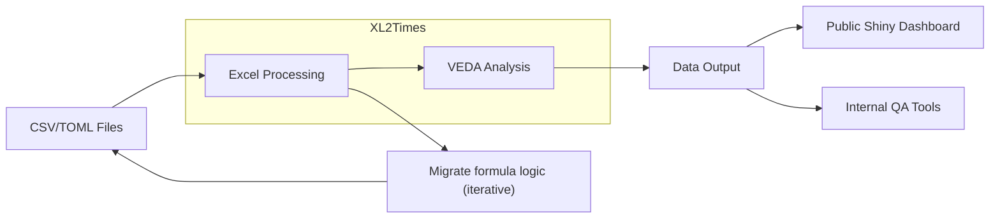

## Pre-processing with Python

```
THIS MODULE IS UNDER DEVELOPMENT
```

### Installation

To install this module and its dependencies using Poetry, navigate into the `PREPARE-TIMES-NZ` directory and run:

```bash
poetry install
```

If you require the development dependencies, run:

```bash
poetry install --with dev
```

### Running Tests

Run tests within `PREPARE-TIMES-NZ`:

```bash
poetry run pytest
```

### Running the Pipeline

To prepare the TIMES-NZ model files, execute the following command from within the `PREPARE-TIMES-NZ` directory:

```bash
poetry run doit
```

This command runs a `doit` pipeline that creates Excel files ready for VEDA processing based on the user config and data for TIMES 3.0.

Alternatively, you can execute:

```bash
poetry run python scripts/prepare_times_nz_from_archive.py
```

This fully generates the TIMES 2.1.3 Excel files from the raw tables summary text. It exists as a proof of concept for generation methods, ensuring the created files match TIMES 2.1.3 perfectly.

Note: Each script is designed to run locally and stores all outputs in the `output` directory and intermediate data in `data_intermediate`. These directories are not tracked by git and are fully refreshed on every run.

### STRUCTURE

See `docs/data_structures.md` for details about the module's structure and organization.

### Configuration files

Refer to `docs/configuration_file_guide.md` for descriptions and examples of the `.toml` configuration files.

### Model methodology and documentation

The directory `docs/model_methodology/` contains documentation for methods used in creating TIMES 3.0.

After executing the main preparation script, a metadata file is created at `data_intermediate/stage_0_config/config_metadata.csv`. This file lists all worksheets and tags generated with helpful descriptions assigned to VEDA tags in the configuration files.

Please add any new methods or submodel documentation to this directory.

### General Future State


