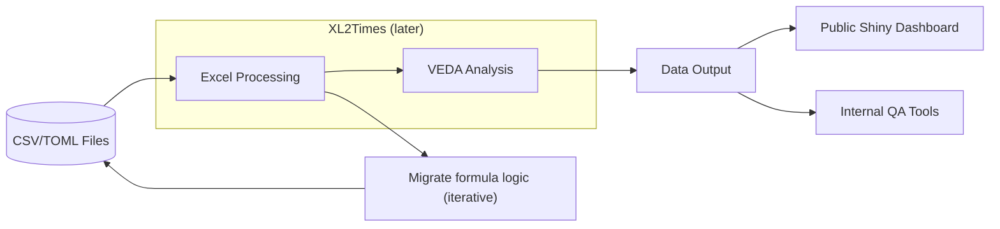

## Pre-processing with Python

```
THIS MODULE IS UNDER DEVELOPMENT
```

To prepare the TIMES-NZ model files, we will be implementing pre-processing using the following command:

```
python prepare_times_nz.py
```

This script will handle the necessary steps to preprocess the data and ensure it is ready for further analysis and modeling.

Currently, a one-off script was run to produce the csv layout mirroring the existing structure (using the XL2TIMES raw_tables.txt)

Then, `prepare_times_nz.py` uses these files to generate the smaller excel files, which Veda can use to produce TIMES runs. 

All existing excel input Veda files are kept in the repo (specifically the `TIMES-NZ` module) as this is a work in progress and the logic in these sheets needs to be readily available for further development work.

In the future, the input csvs will need to properly sourced and documented. 


