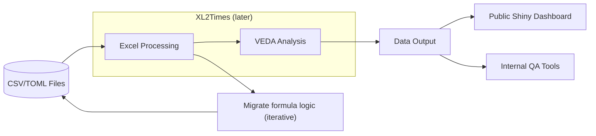

## Pre-processing with Python

```
THIS MODULE IS UNDER DEVELOPMENT
```

To prepare the TIMES-NZ model files, we will be implementing pre-processing using the following command:

```
python prepare_times_nz.py
```

This script will handle the necessary steps to preprocess the data and ensure it is ready for further analysis and modeling.

Currently, a one-off script was run to produce the csv layout mirroring the existing structure (using the XL2TIMES raw_tables.txt)

Then, `prepare_times_nz.py` uses these files to generate the smaller excel files, which Veda can use to produce TIMES runs. 

All existing excel input Veda files are kept in the repo (specifically the `TIMES-NZ` module) as this is a work in progress and the logic in these sheets needs to be readily available for further development work.

In the future, the input csvs will need to properly sourced and documented. 

### Current Gaps

Currently, the script is set to overwrite all files with equivalent files in manual_file_backups. This means we have some control over what we are overwriting.

These backup files must be labelled with a MANUAL_ prefix, or the xl2TIMES reader tries to read them and then breaks. 

While all current excel files can be generated, only the Base Year and SysSettings Files have been appropriately tested, so not all files have been given backups or fully automated. 

Further, the manual files MUST remain in the repository until we are satisfied that all the underlying logic or documentation has been extracted into scripts or config files. This is true even for files we know are "working". 

This means the current workflow is to take an existing manual excel file and add it to the backup folder, then generate the automatic file using the `write_workbook()` function, then test and ensure that this has made no changes from v2_1_3. Also, the current script to identify backup files will need adjusting when we used nested files in folders. 


## General Future State


